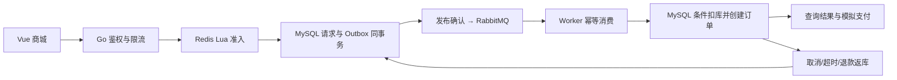

# PULSE 脉冲生活 · Go 高并发秒杀商城

基于 Go、Vue 3 和 TypeScript 的单商家商城系统，提供用户商城与运营后台，支持普通交易、异步秒杀、订单履约和库存管理。后端采用 MySQL、Redis 与 RabbitMQ，实现事务持久化、原子库存准入和异步订单处理。

秒杀链路通过 Redis Lua 控制准入名额，MySQL 事务保存请求与 Outbox，RabbitMQ 驱动异步处理，数据库条件扣库并幂等创建订单。同时支持取消、超时、退款、重复消息处理与缓存重建，保障库存一致性和故障恢复。

当前支付与物流采用模拟流程，未接入第三方支付或物流服务，不产生真实资金交易。

## 快速开始

环境要求：Go **1.25+**、Node.js **22.12+（推荐 24）**。在项目根目录执行以下命令，安装前端依赖并启动本地演示模式：

```powershell
cd frontend
npm ci
npm run build
cd ..
go run ./cmd/mall -mode demo
```

打开 [商城首页](http://127.0.0.1:8088)，`Ctrl+C` 停止。也可在根目录运行 `./scripts/start-mall.ps1`。

| 演示身份 | 邮箱 | 密码 |
|---|---|---|
| 用户 | demo@pulse.local | PulseDemo2026! |
| 管理员 | admin@pulse.local | PulseAdmin2026! |

登录页可填充演示账号。固定账号只在 `demo` 模式生成。`.local/mall.db` 保存商品与订单，重启后会话失效，未完成的排队请求关闭。种子活动首次创建后持续 48 小时，到期后在后台新建活动。

演示模式使用 SQLite、嵌入式 Redis 模拟器与进程内队列，无需单独部署中间件，适合本地预览和功能调试。使用 MySQL、Redis 与 RabbitMQ 的运行方式见下文。

## Docker Compose 部署

准备支持 Linux 容器的 Docker 与 Docker Compose 环境；Windows 可使用 Docker Desktop。确保端口 `8088` 可用，在项目根目录使用 PowerShell 执行：

```powershell
./scripts/setup-mall.ps1
docker compose --env-file .env.mall -f compose.mall.yaml up --build -d
docker compose --env-file .env.mall -f compose.mall.yaml ps -a
```

脚本生成随机密码且不覆盖已有配置。管理员账号读取本地 `.env.mall` 的 `ADMIN_EMAIL / ADMIN_PASSWORD`。`init` 显示 `Exited (0)` 是初始化成功的正常状态。API 与 Worker 分离，中间件不开放宿主机端口，商城仅绑定本机。

配置项、启动方式与调试步骤见 [运行与调试指南](docs/mall-running.md)。

## 核心功能

| 区域 | 能力 |
|---|---|
| 商城 | 品牌首页、分类搜索、排序分页、详情、响应式页面、本地 SVG 插画 |
| 用户 | 注册登录、加盐密码派生、Redis 会话、退出、地址增删改查 |
| 交易 | 持久化购物车、服务端计价、商品/地址快照、幂等请求、模拟支付、取消、超时关单、未发货退款、发货、收货 |
| 秒杀 | 独立库存、Lua 原子准入、一人一次、异步受理、结果查询、Outbox、发布确认、手动 ACK、重试、死信重投 |
| 恢复 | 预扣租约、孤儿请求墓碑、排队超时、库存代次隔离、显式重建、到期归还配额 |
| 后台 | 商品上下架/补货、活动管理、订单履约、真实统计、Outbox 与库存守恒监控、审计 |
| 安全 | HttpOnly/SameSite Cookie、生产 Secure Cookie、Origin/CSRF、服务端权限与归属、参数化 SQL、限流、并发上限、超时、CSP |

当前业务范围为单规格商品、固定分类、包邮，以及每人每场一次秒杀参与资格。暂不支持发货后售后、优惠券、多店铺、第三方支付和物流回调。

## 系统架构



系统采用模块化单体与独立 Worker 架构。HTTP `202` 表示秒杀请求已持久化，客户端需查询异步处理结果获取订单状态。MySQL 作为库存账本；Redis 活动缓存丢失时关闭准入，由管理员按数据库库存重建。

## 项目文档

- [运行与调试指南](docs/mall-running.md)
- [架构、状态机与故障恢复](docs/mall-architecture.md)
- [接口与安全边界](docs/mall-api-security.md)
- [测试记录与性能验证方法](docs/mall-validation.md)

## 测试与检查

在项目根目录执行单元测试、静态检查和秒杀并发一致性测试：

```powershell
go test ./...
go vet ./...
$env:MALL_STRESS_USERS='1000'
go test ./internal/mall -run TestFlashConcurrencyAndDuplicateDelivery -count=1 -v
Remove-Item Env:MALL_STRESS_USERS
```

默认测试使用 SQLite 与 miniredis，覆盖并发准入、幂等消费、事务回滚及库存恢复等路径。可通过 `TEST_MYSQL_DSN` 切换到 MySQL 测试环境，并通过 `TEST_REDIS_ADDR` 与 `TEST_AMQP_URL` 启用真实中间件集成测试。

项目提供 CI 工作流和 `cmd/mallbench` HTTP 压测工具。环境配置、历史验证记录与压测方法见 [测试文档](docs/mall-validation.md)；全链路性能指标需在目标部署环境中实测。

## 项目结构

```text
cmd/mall/                 商城启动入口，demo/stack 与 api/worker
cmd/mallbench/            完整环境 HTTP 并发测试与异步结果核对
internal/mall/            商城、事务、Redis、RabbitMQ、安全 API 与测试
frontend/src/             Vue 商城、后台、组件和类型定义
web/mall/dist/            构建资源，Go embed 打包
compose.mall.yaml         MySQL、Redis、RabbitMQ 与应用服务编排
Dockerfile.mall           前端构建 → Go 构建 → 非 root 运行
.vscode/                  调试配置
scripts/                  启动与随机配置生成
docs/mall-*.md            商城架构、接口、运行与测试文档
```

## 历史版本

仓库保留基础版实现，包括 `cmd/server`、`internal/store`、`cmd/loadtest` 及对应的 `compose.yaml`、`Dockerfile`，可通过 `go run ./cmd/server` 启动。相关说明见 [基础版归档](docs/basic-version.md) 和 `docs/00`～`07`。当前商城使用 `cmd/mall`、`compose.mall.yaml` 与 `Dockerfile.mall`。
