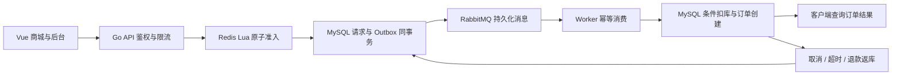

# PULSE 脉冲生活 · Go 高并发秒杀商城

基于 Go、Vue 3 和 TypeScript 的单商家商城系统，提供用户商城与运营后台，支持普通交易、异步秒杀、订单履约和库存管理。后端使用 MySQL、Redis 与 RabbitMQ，通过 Lua 原子准入、事务 Outbox 和幂等消费处理秒杀请求。

## 核心功能

| 模块 | 功能 |
|---|---|
| 商城 | 商品展示、分类搜索、排序分页、详情、响应式页面 |
| 用户 | 注册登录、Redis 会话、地址管理、个人中心 |
| 交易 | 持久化购物车、服务端计价、订单快照、幂等下单、模拟支付、取消、超时关单、退款、发货与收货 |
| 秒杀 | 独立活动库存、Lua 原子准入、一人一次、异步受理、结果查询 |
| 消息处理 | 事务 Outbox、发布确认、手动 ACK、重试、死信重投 |
| 恢复 | 预扣租约补偿、排队超时、库存代次隔离、缓存重建、活动库存归还 |
| 运营后台 | 商品上下架与补货、活动管理、订单履约、统计、库存守恒核对、审计 |
| 安全 | 密码加盐派生、Cookie 会话保护、CSRF/Origin 校验、服务端鉴权、参数化 SQL、限流与超时 |

当前支持单规格商品、固定分类、包邮，以及每人每场一次秒杀参与资格。支付、退款与物流使用模拟流程，未接入第三方资金交易或物流回调；暂不支持优惠券、多店铺和发货后售后。

## 系统架构



系统采用模块化单体与独立 Worker 架构。普通下单在数据库事务内完成；秒杀接口返回 HTTP `202` 表示请求已持久化，客户端通过查询接口获取异步订单结果。

MySQL 作为库存账本，Redis 控制准入。活动缓存丢失时暂停准入，通过后台按数据库库存重建。详细状态机与恢复流程见 [架构文档](docs/architecture.md)。

## 部署运行

准备 Docker 与 Docker Compose，在项目根目录使用 PowerShell 执行：

```powershell
./scripts/setup.ps1
docker compose up --build -d
docker compose ps -a
```

配置脚本生成带随机密码的 `.env`，已有配置不会被覆盖。其他平台可复制 `.env.example` 为 `.env` 并填写随机凭据。配置文件不要提交到仓库。

访问 [商城首页](http://127.0.0.1:8088)，使用 `.env` 中的 `ADMIN_EMAIL` 与 `ADMIN_PASSWORD` 登录后台。首次部署创建数据库表和管理员，商品与秒杀活动由后台配置；不会自动创建演示用户、商品或活动。

API 与 Worker 分开运行。默认仅将商城端口绑定到宿主机回环地址，中间件位于内部网络。HTTPS、反向代理与维护操作见 [部署指南](docs/deployment.md)。

## 本地开发

环境要求：Go **1.25+**、Node.js **22.12+（推荐 24）**。

```powershell
cd frontend
npm ci
npm run build
cd ..
go run ./cmd/mall -mode demo
```

也可运行 `./scripts/start.ps1`。本地预览模式使用 SQLite、嵌入式 Redis 模拟器与进程内队列，无需独立中间件，仅允许监听回环地址。

| 预览账号 | 邮箱 | 密码 |
|---|---|---|
| 用户 | demo@pulse.local | PulseDemo2026! |
| 管理员 | admin@pulse.local | PulseAdmin2026! |

固定账号与示例商品仅用于 `demo` 模式，数据保存在 `.local/mall.db`。默认启动模式为 `stack`，需要提供 MySQL、Redis 与 RabbitMQ 配置。

## 测试

```powershell
go test ./...
go vet ./...
go build ./cmd/...
```

测试覆盖并发准入、幂等下单、库存守恒、事务回滚、消息重放、缓存恢复与权限校验。默认使用 SQLite 与 miniredis，可配置独立中间件执行集成测试。仓库提供 CI 工作流和 `cmd/mallbench` HTTP 压测工具，使用方法见 [测试指南](docs/testing.md)。

## 项目结构

```text
cmd/mall/             应用入口，API / Worker / 初始化
cmd/mallbench/        HTTP 并发压测与订单结果核对
internal/mall/        商城业务、数据访问、消息处理、安全 API 与测试
frontend/src/        Vue 商城、运营后台、组件与类型
web/mall/            前端构建资源与 Go embed
compose.yaml         应用及中间件服务编排
Dockerfile           前端与 Go 多阶段构建
scripts/             配置生成与本地启动脚本
docs/                架构、接口、部署与测试文档
.github/workflows/   持续集成
```

## 文档

- [部署与开发指南](docs/deployment.md)
- [架构、状态机与故障恢复](docs/architecture.md)
- [API 与安全边界](docs/api-security.md)
- [测试与性能验证](docs/testing.md)
