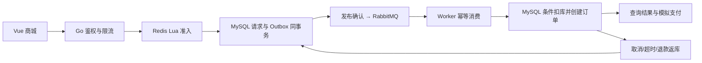

# PULSE 脉冲生活 · Go 高并发秒杀商城

适合学完 Go 基础后深入学习的完整单商家 Web 项目。Vue 3 + TypeScript 提供商城和运营后台，Go 实现普通交易与异步秒杀，完整环境使用 MySQL、Redis、RabbitMQ。

**最大特点：可解释、可恢复、可验证的防超卖链路。** Redis Lua 控制秒杀名额，MySQL 事务保存请求与 Outbox，RabbitMQ 异步处理，数据库再次检查库存并幂等创建订单。取消、超时、退款、消息重复和缓存重建都有明确处理。

所有商品、支付和物流均为教学模拟，不产生真实资金交易。

## 先运行

VS Code 打开 **seckill-lab 这个文件夹**。需要 Go **1.25+**、Node.js **22.12+（推荐 24）**。首次运行需要下载依赖。本机使用 Go 1.26.5 / Node 24.14.1 验证。

```powershell
cd E:\STUDY\项目\seckill-lab
cd frontend
npm ci
npm run build
cd ..
go run ./cmd/mall -mode demo
```

打开 [商城首页](http://127.0.0.1:8088)，`Ctrl+C` 停止。也可在根目录运行 `./scripts/start-mall.ps1`。

| 演示身份 | 邮箱 | 密码 |
|---|---|---|
| 用户 | demo@pulse.local | PulseDemo2026! |
| 管理员 | admin@pulse.local | PulseAdmin2026! |

登录页可填充演示账号。固定账号只在 `demo` 模式生成。`.local/mall.db` 保存商品与订单，重启后会话失效，未完成的排队请求关闭。种子活动首次创建后持续 48 小时，到期后在后台新建活动。

演示模式使用 SQLite、嵌入式 Redis 模拟器与进程内队列；**它不能证明真实中间件性能**。完整模式见下文。

## 完整部署

安装并启动 Docker Desktop（Linux containers），停止占用 8088 的演示服务。

```powershell
./scripts/setup-mall.ps1
docker compose --env-file .env.mall -f compose.mall.yaml up --build -d
docker compose --env-file .env.mall -f compose.mall.yaml ps -a
```

脚本生成随机密码且不覆盖已有配置。管理员账号读取本地 `.env.mall` 的 `ADMIN_EMAIL / ADMIN_PASSWORD`。`init` 显示 `Exited (0)` 是初始化成功的正常状态。API 与 Worker 分离，中间件不开放宿主机端口，商城仅绑定本机。

**本机没有 Docker，真实 Redis/RabbitMQ 和 Compose 集成尚未执行；已提供可选集成测试与 CI。** 详细步骤见 [运行与 VS Code 调试](docs/mall-running.md)。

## 已实现功能

| 区域 | 能力 |
|---|---|
| 商城 | 品牌首页、分类搜索、排序分页、详情、响应式页面、本地 SVG 插画 |
| 用户 | 注册登录、加盐密码派生、Redis 会话、退出、地址增删改查 |
| 交易 | 持久化购物车、服务端计价、商品/地址快照、幂等请求、模拟支付、取消、超时关单、未发货退款、发货、收货 |
| 秒杀 | 独立库存、Lua 原子准入、一人一次、异步受理、结果查询、Outbox、发布确认、手动 ACK、重试、死信重投 |
| 恢复 | 预扣租约、孤儿请求墓碑、排队超时、库存代次隔离、显式重建、到期归还配额 |
| 后台 | 商品上下架/补货、活动管理、订单履约、真实统计、Outbox 与库存守恒监控、审计 |
| 安全 | HttpOnly/SameSite Cookie、生产 Secure Cookie、Origin/CSRF、服务端权限与归属、参数化 SQL、限流、并发上限、超时、CSP |

范围：单规格商品、固定分类、包邮、每人每场一次参与资格。发货后售后、优惠券、多店铺、真实支付和物流回调未实现。



HTTP `202` 表示请求已持久化，**不代表订单已生成或已付款**。MySQL 是库存账本；Redis 丢失时关闭准入，由管理员按数据库库存重建。架构采用模块化单体与独立 Worker，重点是高并发设计和正确性，不宣称“百万 QPS”或生产级高可用。

## 按重要性学习

从 [阶段规划与第一课](docs/mall-learning.md) 开始：普通下单事务 → Lua 防超卖 → Outbox 与幂等消费 → 异常恢复 → 安全与前端 → 部署与简历表达。提问时给出文件名、函数名和具体语句即可。

- [架构、状态机与故障恢复](docs/mall-architecture.md)
- [接口与安全边界](docs/mall-api-security.md)
- [验证记录与实验方法](docs/mall-validation.md)

## 验证

```powershell
go test ./...
go vet ./...
$env:MALL_STRESS_USERS='1000'
go test ./internal/mall -run TestFlashConcurrencyAndDuplicateDelivery -count=1 -v
Remove-Item Env:MALL_STRESS_USERS
```

本机真实 MySQL 9.7：1000 用户、64 并发争抢 30 件库存，30 个请求受理、970 个售罄、30 个订单，重复投递与返库后库存守恒。Redis 使用 miniredis；这是正确性实验，**不是 HTTP/RabbitMQ 全链路容量报告**。

```text
cmd/mall/                 新版启动入口，demo/stack 与 api/worker
cmd/mallbench/            完整环境 HTTP 并发测试与异步结果核对
internal/mall/            商城、事务、Redis、RabbitMQ、安全 API 与测试
frontend/src/             Vue 商城、后台、组件和类型定义
web/mall/dist/            构建资源，Go embed 打包
compose.mall.yaml         完整部署
Dockerfile.mall           前端构建 → Go 构建 → 非 root 运行
.vscode/                  调试配置
scripts/                  启动与随机配置生成
docs/mall-*.md            新版说明与课程
```

旧版 `cmd/server`、`internal/store` 等保留为基础课程对照，仍可 `go run ./cmd/server`。原说明见 [基础版归档](docs/basic-version.md)，`docs/00`～`07`、旧 `compose.yaml / Dockerfile / cmd/loadtest` 属于基础版，请勿与新版混用。
