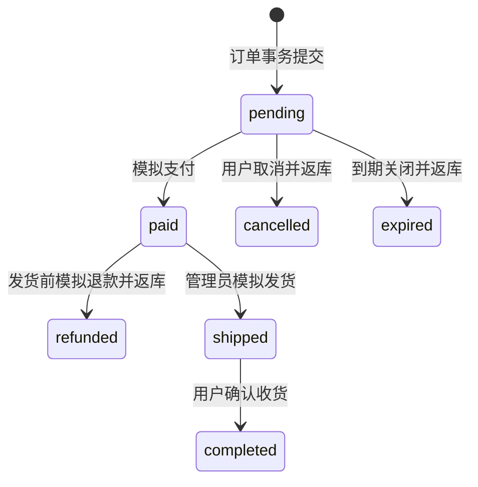

# 架构与故障恢复

## 先区分三个数

- 商品普通库存：`mall_products.stock`，普通结算使用。
- 活动账本库存：`mall_activities.stock`，只有秒杀订单事务真正扣减它。
- Redis 可抢名额：提前挡住大多数失败请求；预扣后订单可能尚未生成。

创建活动时在同一事务内扣普通库存、创建活动配额。例如商品 500 件，划出 100 件参与活动，普通库存变成 400，活动库存 100。两条购买链路不竞争同一个库存计数。

活动核对公式：

```text
初始配额 = 数据库剩余配额 + 有效秒杀订单数量 + 已归还普通库存数量
```

有效订单是 pending / paid / shipped / completed，取消、超时、退款均不再占库存。监控差额应为 0，核对 SQL 使用单条查询的一致性快照。排队请求不属于有效订单，所以排队时 Redis 可抢名额通常小于数据库剩余配额。

## 正常请求如何流动

1. `api.go/join` 校验 Redis 会话、CSRF、来源与请求编号，执行用户和全局限流。
2. `worker.go/Submit` 生成确定性 ticket ID。相同用户、活动和请求编号对应相同 ID。
3. `cache.go/reserveScript` 在一个 Lua 脚本内检查活动时间、启用状态、名额和用户参与记录，同时扣名额、写参与记录、写 30 秒恢复租约。
4. 只有准入成功者进入 `flash.go/AcceptTicket`。事务校验活动代次/状态/时间/地址，然后同时写 `mall_tickets` 与 `mall_outbox`。
5. 返回 HTTP 202。浏览器看到 queued 并轮询，不能在此显示付款成功。
6. Relay 用 `FOR UPDATE SKIP LOCKED` 领取 Outbox，写入 30 秒处理租约，提交后发布 RabbitMQ 持久化消息。收到 broker confirm 且没有 mandatory return 才标记 published。
7. Worker 消费 `flash.order`，调用 `FinalizeTicket`。锁定用户、活动、ticket；终态直接返回。活动条件扣库、订单写入、ticket 状态变更在同一事务中完成。
8. 数据库提交后才 ACK。浏览器查询到 ordered 后显示订单入口，接着执行模拟支付。

普通 `Checkout` 不经过消息队列：用户锁 → 检查幂等键和请求指纹 → 地址归属 → 按商品 ID 升序锁商品 → 条件扣库 → 写订单 → 调整购物车 → 提交。所有金额来自数据库，单位为“分”。

## 状态机



状态行加锁后判断，重复相同操作返回原结果；非法跨状态操作返回 409。支付与超时关闭竞争同一订单行，不会既成功支付又释放库存。价格和地址保存在订单快照中，后续编辑不改变历史订单。

ticket 状态仅 queued → ordered 或 queued → rejected。一人每场一次是终身参与资格，取消/退款返还库存但不返还资格，避免一个用户重复占坑。消费者可处理活动结束前已受理的请求；超过 120 秒仍排队的请求由恢复任务关闭。

## 失败矩阵

| 失败点 | 保存了什么 | 如何恢复 |
|---|---|---|
| Lua 前 Redis 不可用 | 没有新预扣 | 返回 503，关闭准入 |
| Lua 成功但 API 未写数据库就崩溃 | Redis hold + lease | 扫描到期租约，先写 rejected 墓碑和 release Outbox，再释放名额 |
| ticket/Outbox 事务写入失败 | 事务全部回滚，Redis hold 仍在 | 租约恢复，不在未知提交结果时盲目返库 |
| 数据库提交但响应丢失 | ticket 与 Outbox 已存在 | 相同请求编号重试返回原 ticket |
| MQ 发布失败 | Outbox 未 published | 指数退避，最多间隔 60 秒，持续重试 |
| MQ 已收消息但 confirm/数据库标记丢失 | 消息可能已入队 | 再投递，消费者幂等处理 |
| 消费者扣库后写订单失败 | 同一事务回滚 | Reject 重试，重复失败进入 DLQ |
| 消费者提交后 ACK 丢失 | 订单已存在且 ticket 为 ordered | 重投读终态，不再扣库 |
| 订单取消/超时返库后 Redis 暂不可用 | SQL 返库及 release Outbox 已提交 | 待缓存恢复继续投递释放事件 |
| 缓存缺失 | SQL 仍是账本 | 关闭准入，管理员执行重建 |
| 老释放消息在重建后才到达 | 消息带旧 epoch | 忽略，不修改新一代库存 |

为什么补偿先写墓碑：API 可能只是慢，恢复任务若直接加回库存，迟到的 API 仍可能创建 queued 请求。`FenceHold` 和 `AcceptTicket` 使用数据库锁与唯一约束协调，墓碑成为不可越过的终态。

释放脚本用 `(活动代次, ticket)` 去重；消息至少一次投递，库存只加一次。去重标记与用户记录不使用随意的短 TTL，以免过期后重放事件再次返库。

## 显式重建

`RebuildActivity` 先关闭 Redis 准入并暂停数据库活动，再拒绝当前 queued 请求，随后在活动行锁内创建新 epoch，以数据库库存为快照写入禁用缓存，恢复参与用户集合，提交数据库后开放准入。

订单返库事务也锁活动行，读取当前 epoch。于是旧返库若先提交，会被重建快照包含；若后提交，就携带新 epoch 修改新缓存。旧事件不能在新缓存里多加库存。

重建失败可能留下禁用或代次不匹配的缓存，此时继续关闭准入并人工重试。该流程优先保证库存安全，不承诺在所有故障下持续可售。无法持久化的旧预扣可能保留参与标记，使该用户本场无法再抢；这是保守失败的取舍。

活动结束后等待 130 秒且确认没有 queued 请求，再将剩余活动库存返还商品普通库存，活动归档。归档后订单退款直接返还普通库存，并增加活动 returned 计数，保持守恒。

## 高并发保护与实际边界

- 单 API 实例最多同时处理 256 个 API 请求；超限直接 429，不堆积无限 goroutine。
- Redis 全局秒杀固定窗口限制 2000 次/秒，每用户 5 次/秒。限流参数是教学配置，不是系统已达到的容量承诺。
- Lua 让绝大多数售罄请求不触碰 MySQL；胜出者仍要持久化 ticket 与 Outbox，保证可靠受理。
- 数据库连接池 32；用户/商品/活动按约定加锁；订单库存条件更新和事务是最后防线。
- 每 Worker 进程 4 个 Relay、4 个消费者，消费预取 8；可多 Worker 共享 DB/MQ，Outbox 用 SKIP LOCKED 分配。
- MQ 队列 durable、quorum，消息 persistent，confirm + mandatory，手动 ACK，错误 Reject。超过投递限制进死信，后台一次最多重投 100 条。

这个实现仍有热点活动行锁、每条消息新建发布 channel、单 Redis、SQL 轮询和活动列表扫描等限制。单节点 quorum 队列不等于多副本高可用；Redis AOF everysec 也有故障丢失窗口。即使缓存旧值导致多准入，SQL 最后检查仍拒绝超额订单，但无法保证所有受理者都成功。

后续优化必须先测出瓶颈，再考虑发布 channel 池、批量 claim、读缓存、按活动拆分、真实 Prometheus/告警、数据库备份、Redis 高可用和 RabbitMQ 三节点。当前没有 Outbox/历史活动自动清理任务，长期运行需要归档策略；演示数据库也不能替代 MySQL 并发验证。

## 阅读依据

发布确认只确认 broker 接收，消费 ACK 只确认消费者完成，两者职责不同，见 [RabbitMQ confirms](https://www.rabbitmq.com/docs/confirms)。至少一次投递需要业务幂等，见 [RabbitMQ reliability](https://www.rabbitmq.com/docs/reliability)。本实现使用 Reject 标识处理失败，避免新版 Nack 不增加投递失败计数的问题，见 [Quorum queues](https://www.rabbitmq.com/docs/quorum-queues)。
