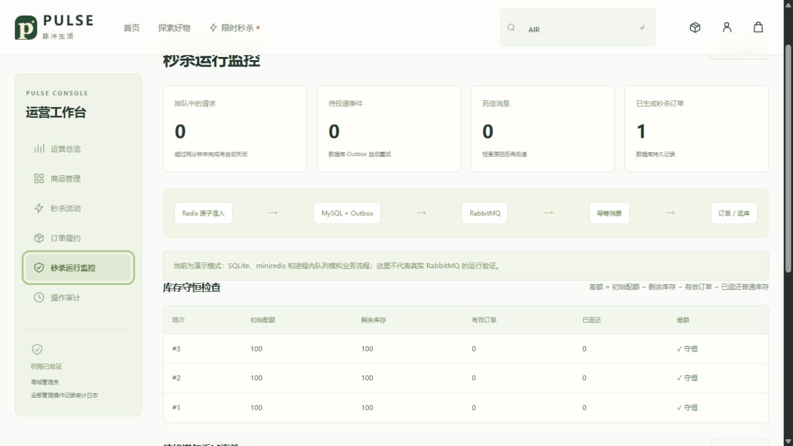

# 验证记录与复现实验

记录日期：2026-09-26。Windows，本机 Go 1.26.5、Node 24.14.1、MySQL 9.7.0。以下只记录实际执行过的项目，不将 CI 配置当作已经运行的结果。

## 本机已执行

| 验证 | 结果 |
|---|---|
| Vue TypeScript 检查与 Vite 生产构建 | 通过 |
| `go test ./...` | 通过，包括新版商城与保留的基础版测试 |
| `go vet ./...` | 通过 |
| 商城 10 组测试，SQLite + miniredis | 通过 |
| 同一组商城测试，真实 MySQL 9.7 + miniredis | 通过 |
| MySQL 并发准入：200 用户、64 并发、库存 30 | 30 受理、170 售罄、30 订单；准入阶段约 165ms |
| MySQL 并发准入：1000 用户、64 并发、库存 30 | 30 受理、970 售罄、30 订单；准入阶段约 167ms |
| 浏览器本地演示 | 登录、搜索、加购物车、普通结算、模拟支付、秒杀异步订单、退款、管理员发货、用户收货和库存监控通过 |
| 手机宽度首页 | 390px 视口检查通过，页面无横向溢出 |

准入耗时不包括准备用户、后续订单生成和验证。Redis 是模拟器，测试直接调用 Go Engine，不经过 HTTP；不应把这些数字作为容量或 QPS 结论。1000 用户测试的总执行时间约 10.5 秒，主要包含创建测试用户与地址等准备工作。

## 测试覆盖的失败路径

`internal/mall/mall_test.go`：

1. 并发争抢、重复 Finalize、重复消费 Outbox、重复取消与释放，核对数据库和 Redis。
2. 普通结算幂等、同键不同内容、大小写不同键、地址/订单归属、支付/退款/履约状态机。
3. 在 SQLite/MySQL 中分别用触发器让订单 INSERT 报错，验证普通和秒杀库存均回滚。
4. 模拟 Lua 后 API 崩溃，墓碑补偿后迟到请求不能生成订单。
5. 删除活动缓存，准入失败；重建拒绝旧 queued，旧释放事件不增加新代次库存。
6. 超时关单与重复归档，活动库存归还普通库存，归档后取消仍守恒。
7. Outbox 租约排他、发布失败退避、启动后台 Relay/消费者后恢复订单。
8. 密码校验、Cookie 属性、401/403、CSRF/Origin、注册提权字段拒绝、伪造订单金额拒绝、退出失效与限流 TTL。
9. 32 个相同请求并发重放只产生一条 ticket；支付与取消竞争只能有一方成功。
10. 模拟 Redis 旧库存多放准入，SQL 最后防线仍只生成一件库存对应的一张订单；排队超时后迟到消费不能下单。

默认每个测试使用新 SQLite 临时库。设置 `TEST_MYSQL_DSN` 后，每个测试建立随机 `pulse_test_*` 数据库，结束时仅删除该随机库。测试账号因此需要 CREATE/DROP DATABASE；不要指向生产服务器。

```powershell
$env:TEST_MYSQL_DSN='root:测试密码@tcp(127.0.0.1:3306)/'
go test ./internal/mall -count=1 -v
$env:MALL_STRESS_USERS='1000'
go test ./internal/mall -run TestFlashConcurrencyAndDuplicateDelivery -count=1 -v
Remove-Item Env:TEST_MYSQL_DSN,Env:MALL_STRESS_USERS
```

## 尚未在本机执行

- Docker 镜像构建和 Compose 启动：没有 Docker 可执行环境。
- 真实 Redis + RabbitMQ 联合测试：本机没有这两个服务。
- `go test -race`：本机没有可用 C/C++ 工具链；CI 的 Linux 环境配置此项。
- 公网 TLS、真实支付、高可用故障切换、生产容量与安全评估。

`TestRealMiddlewareLifecycle` 在没有 `TEST_AMQP_URL / TEST_REDIS_ADDR` 时明确 skip。设置到专用、空的测试中间件后，它验证真实队列发布确认、异步订单、返库、失败投递进死信以及重投。测试使用 `pulse.flash` 队列及活动缓存，禁止连接已有业务环境。

`.github/workflows/ci.yml` 配置 MySQL 8.4、Redis 7.4、RabbitMQ 4.2，构建前端并运行 Go race、vet、build。只有在你的仓库中实际触发并通过，才能称这套组合已通过 CI。

## 完整 HTTP 压测工具

`cmd/mallbench` 适用于完整 stack，创建有标签的测试用户、商品与独立活动。为避免把密码派生混入下单延迟，准备阶段直接写测试用户并创建测试会话；发压请求经过真正的 HTTP 鉴权、CSRF、限流、Lua、Outbox 和 Worker。结束后撤销测试会话，保留数据供检查。

Compose 完整环境启动后：

```powershell
docker compose --env-file .env.mall -f compose.mall.yaml run --rm bench -allow-test-data -base http://api:8088 -origin http://127.0.0.1:8088 -n 1000 -c 64 -stock 100
```

它会输出 JSON：响应分类、准入 RPS、P50/P95/P99、端到端等待时间、订单数量、独立买家数、队列余量与库存守恒差额。429、503、网络异常、订单缺失、超卖、库存不符均使进程非零退出，不把所有请求错误都伪装成“售罄”。

也可从宿主机运行 `go run ./cmd/mallbench`，但必须设置和目标 API 一致的 `MYSQL_DSN / REDIS_ADDR / REDIS_PASSWORD`；Compose 默认不开放中间件端口，优先使用上面的容器命令。`-allow-test-data` 表示明确接受生成测试数据，只用于自己的专用环境。

先用 `-n 100 -c 8 -stock 20` 冒烟，再逐级增加并发。固定窗口限流可能在高负载下返回 429，这是保护机制，不应为了美化报告自动忽略。记录机器 CPU/内存、服务版本、连接池、worker 数量、并发数、失败率与尾延迟；每次实验创建新活动，不污染上一场库存结论。

该工具目前已编译和静态检查，完整中间件下的压测未在本机执行，因此没有虚构的全链路性能数字。

## 页面验收截图



截图显示三个活动的库存守恒检查与无积压状态；演示模式在页面明确标注。它是业务验收证据，不代表真实 RabbitMQ 的部署验证。
